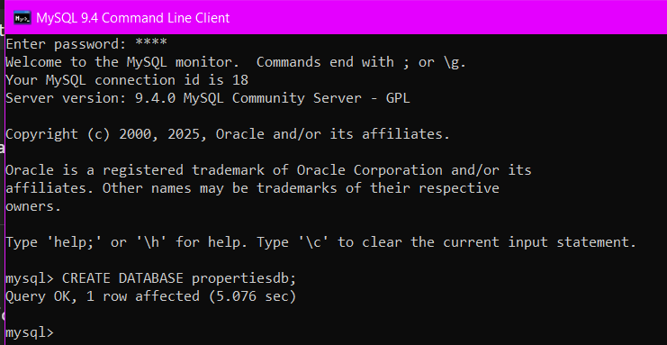
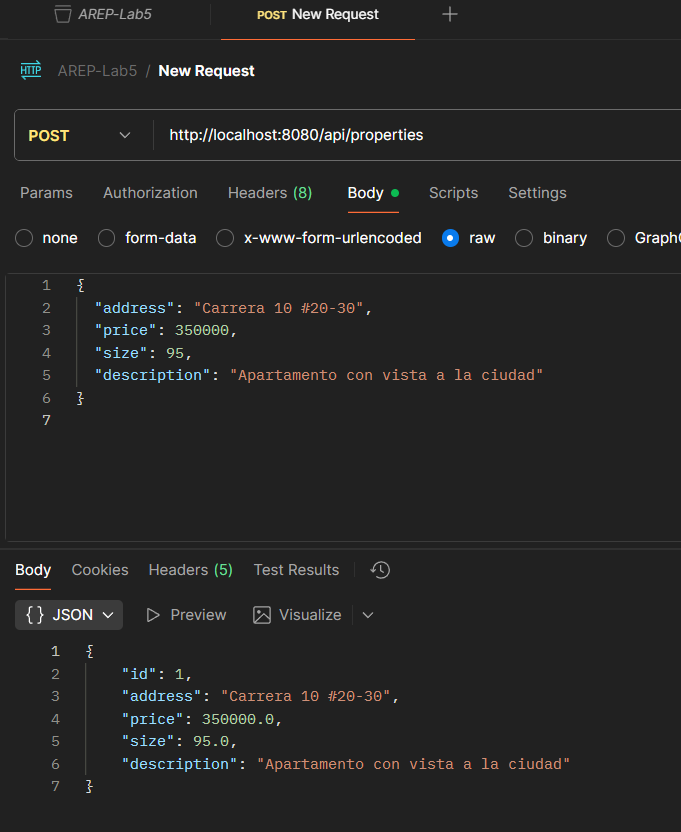
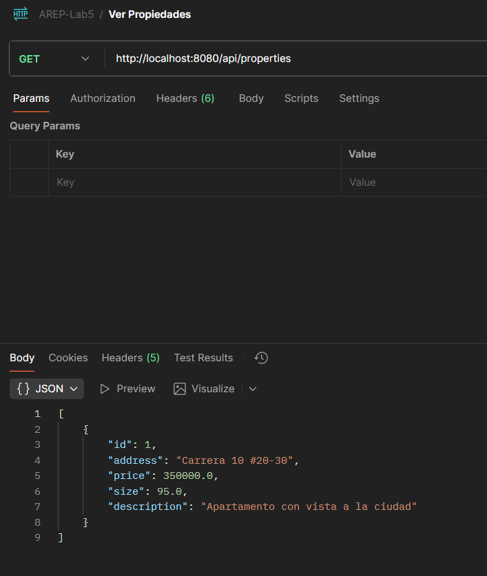
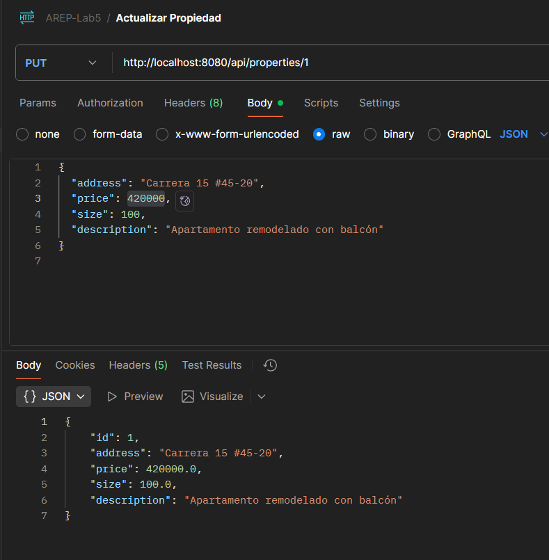
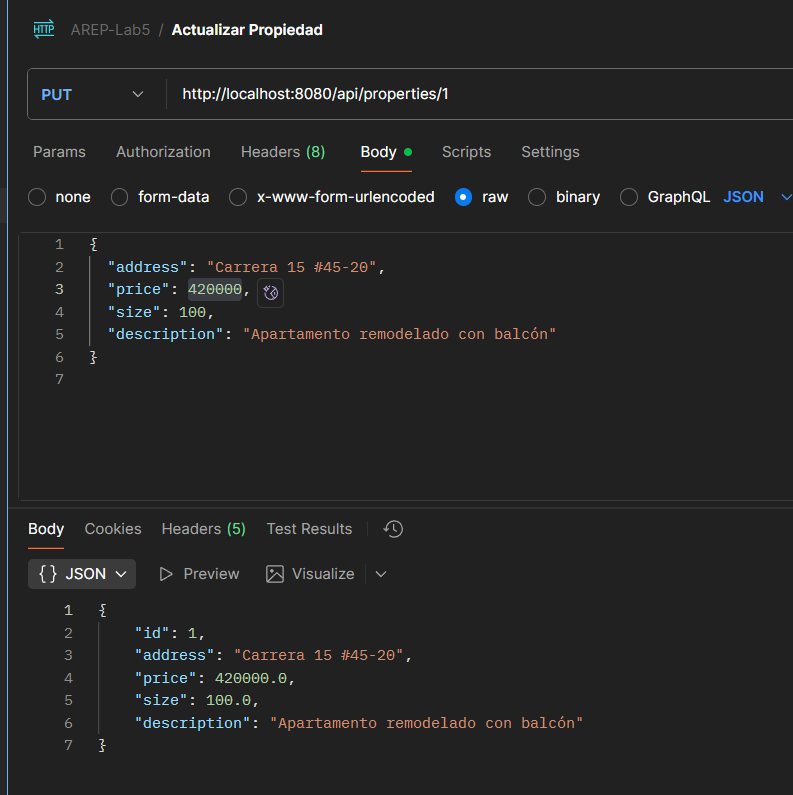
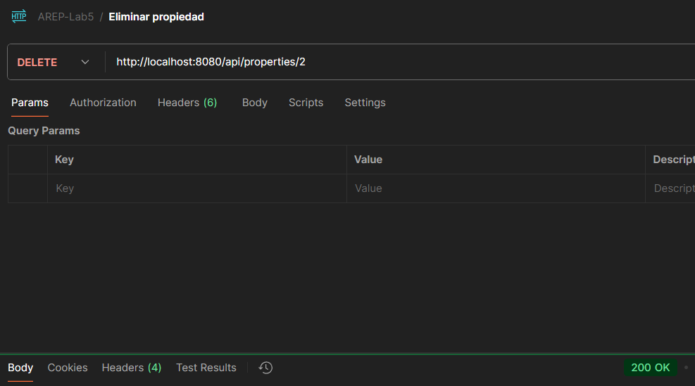
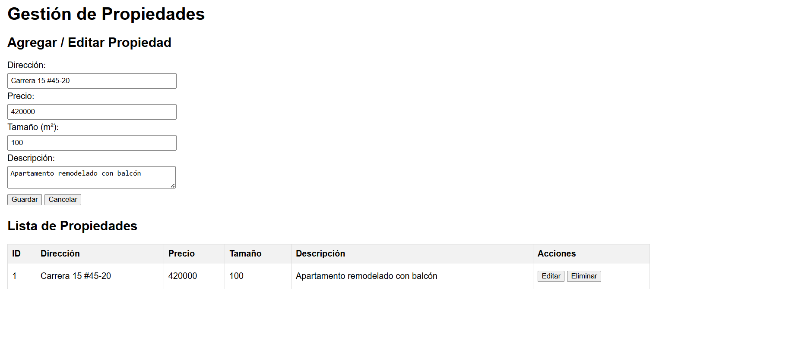
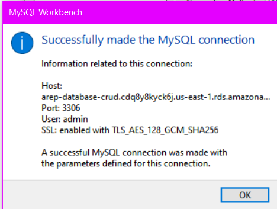

# AREP-LAB5-CRUD

**Base de datos, creacion**

**Prueba crear propiedad**

**Prueba ver propiedades**

**Ver propiedad por id**

**Actualizar propiedad**

**Eliminar propiedad**

**Formulario FrontEnd**

**CONEXION A RDS AWS**

---

